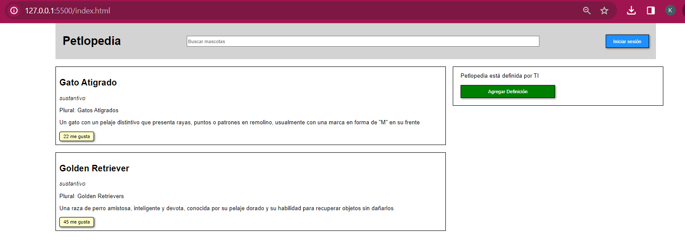
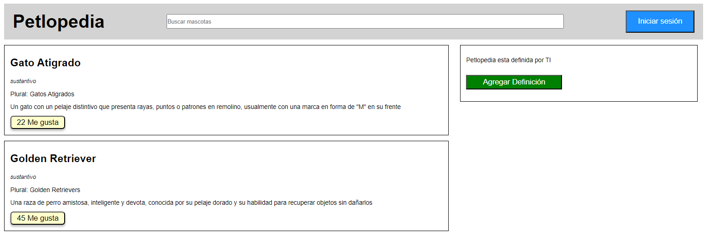

# Petlopedia - Evento Onlick

Este proyecto HTML es una página web básica que muestra información sobre diferentes mascotas, como gatos atigrados y Golden Retrievers.

## Vista del Modelo

Aquí puedes ver la imagen del modelo que se utilizó como referencia:

## Vista Codificada

A continuación, se muestra la imagen del resultado obtenido:

## Estructura del Proyecto

El proyecto se compone de las siguientes secciones:

- **Header**: Contiene el título de la página, un campo de búsqueda y un botón para iniciar sesión.
- **Main**: Incluye dos secciones principales:
  - **Section Izquierdo**:  Aquí se encuentran las secciones con definiciones de gatos y perros.
  - **Aside Derecho**:  Contiene un mensaje sobre Petlopedia y un botón para agregar una definición.

## Funcionalidades Implementadas

1. **Inicio de Sesión / Cerrar Sesión:**
   - El botón "Iniciar sesión" cambia a "Cerrar sesión" al hacer click y viceversa.

2. **Agregar Definición:**
   - El botón "Agregar Definición" desaparece al hacer click.

3. **Me gusta:**
   - Al hacer click en "Me gusta" para una definición, se muestra una alerta indicando que te gustó la definición junto con su título.

4. **Contador de Me gusta:**
   - Cada vez que se hace click en "Me gusta" de una definición, se incrementa el contador de Me gusta respectivo.

## Tecnologías Utilizadas
- **HTML5**: Para la estructura del contenido.
- **CSS3**: Para el diseño y estilizado de la página.
- **JavaScript**: Para agregar interactividad y funcionalidades dinámicas a la página.

## Autor

Este proyecto fue desarrollado por **Valeria Torrealba**.

